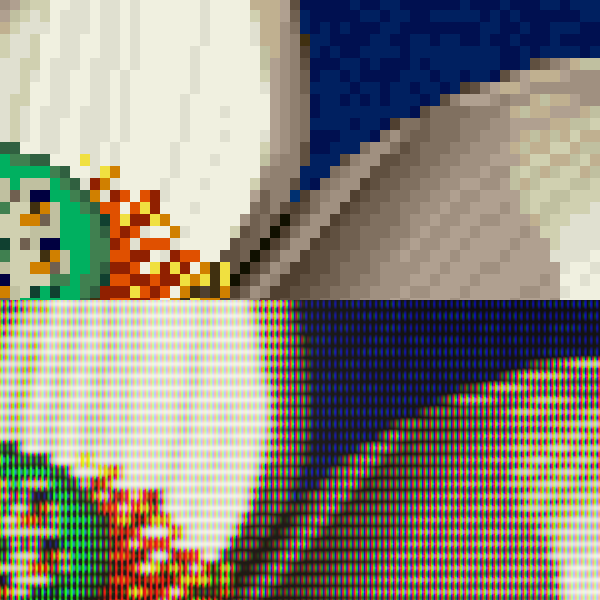

# crt-beans

This is a work-in-progress CRT simulation, prototyped in [Taichi](https://www.taichi-lang.org/) and implemented as a set of [Slang shaders](https://github.com/libretro/slang-shaders) for [RetroArch](https://github.com/libretro/RetroArch) or [librashader](https://github.com/SnowflakePowered/librashader)-compatible software.

||
|---|
|_Detail from [Jim Sachs'](https://amiga.lychesis.net/artists/JimSachs.html) lotus artwork, originally on the "Amiga Dealer" demo. The top is a simple nearest neighbor upscale, and the bottom is generated by the Taichi simulation._|

The original goal for this project was to accurately simulate the scanline-based raster drawing of a CRT television. Scanlines are simulated in (what I believe is) a novel way, which results in consistent and accurate results regardless of the horizontal input resolution or the output resolution.

There are many highly configurable shaders offering more features than this one. The features and configurable parameters will be kept limited for the sake of simplicity in use and development. The goal is to make pixel art look good, not to accurately simulate any arbitrary CRT television.

## Supported features

Currently, supported features include:
* A configurable low-pass filter to simulate the limited bandwidth of an analog connection.
* Optional YIQ encoding to simulate a composite or s-video connection (actual NTSC encoding/decoding is not currently supported).
* Configurable scanline simulation.
* Configurable overscan cropping.
* "Glow" simulation, recreating the glowing areas around bright parts of the screen caused by the scattering of light in the glass.
* Interlacing support in the Slang shaders.
* Support for aperture gille masks, either with predefined subpixel layouts or dynamically generated.
* The Slang shaders have been tested to run in 4k at 60 FPS on a Ryzen 7000 integrated GPU in their default configuration. _Performance is a feature!_
